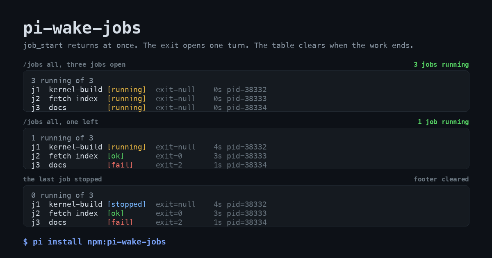

# pi-wake-jobs

[](https://github.com/Barty13/pi-wake-jobs/actions/workflows/test.yml)
[](https://www.npmjs.com/package/pi-wake-jobs)
[](LICENSE)

Background shell jobs for [Pi](https://github.com/badlogic/pi-mono). `job_start` returns while the
command is still running, and the turn ends. When the command exits, Pi starts a new turn with the
result. The agent does not sit in a tool call waiting for you, and you do not sit in a session
waiting for the agent.

```
$ pi install npm:pi-wake-jobs
```



Three moments from one real run. The rows are the bytes the widget drew, captured with
`bun gallery/capture.ts` and drawn by `python3 gallery/render.py`, no mock-up.

Or from git:

```
$ pi install git:github.com/Barty13/pi-wake-jobs
```

## The problem it removes

Pi runs one turn at a time, and a turn is the unit that blocks. Your message does not interrupt a
running tool call. From the Pi RPC docs: a steering message "is delivered after the current assistant
turn finishes executing its tool calls, before the next LLM call". So a foreground command holds the
conversation, not just the terminal.

Three things go wrong in that shape.

**The correction arrives after the damage.** The agent runs a 40 minute build with the wrong flag. You
see it after 30 seconds. Your message sits in a queue for another 39 and a half minutes, by which time
the build is done and the mistake is compiled in. `bash` returns when the command returns, so a turn
that runs 40 minutes is a turn you cannot enter.

**The output stays.** `bash` returns up to 2000 lines or 50 KB into context, the constants
`DEFAULT_MAX_LINES` and `DEFAULT_MAX_BYTES` in its truncate module. That block rides along in every
later request until compaction moves it. A noisy build makes every subsequent turn more expensive, and
pushes useful context toward the compactor.

**Delivery depends on the model remembering.** The usual workaround, `nohup` plus polling, makes the
model the courier. It has to remember to check, decide how often, and still be around when the command
finishes. If the run ends first, or the agent forgets, the result sits in a file that nobody reads.
Here the kernel hands the exit to Pi, so delivery does not depend on the model's diligence.

`pi-wake-jobs` collapses this into one shape: start the command, end the turn, get a turn back when
the command exits.

```
agent:  call job_start with "make -j14 world"     ->  j1, pid 8812, log path
        answer your question, settle
[40 minutes of nothing, and you can talk to the agent the whole time]
        a turn opens: "One background job finished: j1 … exit code 0 after 2431s"
agent:  reads the log, continues
```

## What the same command costs

One noisy command, `head -c 20000 /dev/zero | tr '\0' 'x'`, measured twice: once through the built-in
`bash` tool in a real Pi session with `--no-extensions`, once through `job_start` with a 20000 byte
log. The `bash` figure is the tool result content, 20000 bytes of it, not truncated at this size
because the ceiling sits at 50 KB. Tokens are Pi's own estimator.

| Path | Bytes into context | Tokens | When |
| --- | --- | --- | --- |
| `bash` | 20000 | 5000 | one turn, held open for the whole command |
| `job_start` receipt | 243 | 61 | at once, turn ends |
| wake-up with a 3000 B tail | 3268 | 817 | when the command exits |
| **total through the model** | **3511** | **878** | two short turns |

Roughly six times less, and the whole log is still one `read` away. The gap widens with the command:
`bash` pays up to its 50 KB ceiling, while the wake-up stays near 3.3 KB no matter how much the job
printed.

The receipt quotes the log path twice, so its size follows the length of `PI_JOBS_DIR`: 243 bytes on
the default `$TMPDIR/pi-jobs` path, 183 bytes in the short directory the bench uses. Table C of
`bun bench.ts` prints both the path length and the receipt size.

## What it does not fix

- The command takes exactly as long. Nothing about the build is faster.
- The result is not in the turn that started it. If you need the output to keep reasoning, use `bash`.
- A job does not survive the session, see Limits.
- Pi re-sends context on every request, so the `bash` column is a per-turn tax, not a one-off. Prompt
  caching discounts it, by how much depends on the provider.

## What it adds

Three tools and one command.

| Name | What it does |
| --- | --- |
| `job_start` | Start a command in the background, return its id at once. `command`, optional `name`, optional `cwd`. |
| `job_status` | State, exit code, elapsed seconds, log tail for one job or the whole session. Pass `wait` to block until one job ends. |
| `job_stop` | Signal a job and every command it started. |
| `/jobs` | The human's view: open work above the editor, no model turn. `all` adds finished jobs, `clear` hides the table. |

The footer of the TUI also carries a running count, `2 jobs running`, and it clears itself when
nothing runs. `PI_JOBS_FOOTER=0` leaves the footer alone.

The table above the editor repaints once a second while a job runs, so its seconds move without a key
press. It stops on its own when no job is left, when you clear it, and when the session ends.
`PI_JOBS_TICK_MS=0` keeps it still, a larger number repaints less often.

Each job is one command, one log file, one exit code. The job is a detached child process and the
leader of its own process group, so `job_stop` reaches the compilers and test workers it started,
not only the shell line you typed.

## What changes in a session

The tool call is short. In the transcript a job is one line, and it stays one line while the job
runs:

```
job_start j1 kernel-build  make -j14 world
j1 kernel-build [running] exit=null 12s pid=8812
```

`/jobs` draws open work above the editor, so you see it without asking the model. The header counts
the whole session, not only the rows on screen:

```
1 running of 4, 1 shown
j3  tests             [running]  exit=null   612s pid=8901
```

A table of open work removes itself when the last job ends, so it never sits there with finished
rows. `/jobs all` is the opposite: the whole session, finished rows included, and it stays until you
type `/jobs clear`.

```
0 running of 4
j1  kernel-build      [ok]       exit=0    2431s pid=8812
j2  fetch index       [ok]       exit=0      18s pid=8840
j3  tests             [running]  exit=null   612s pid=8901
j4  docs              [fail]     exit=2      44s pid=8907
```

The footer carries the count when you never type `/jobs`, so open work shows while you do something
else. A log path costs 60 columns, so the table leaves it out. `job_status` and the wake-up both
print it. In print and JSON modes, where there is no widget, the command prints the same rows with
the path appended.

The wake-up is a normal message in the conversation, so you see exactly what the agent sees:

```
One background job finished:
- j1 kernel-build: exit code 0 after 2431s. Command: make -j14 world
  Log: /tmp/pi-jobs/j1-8812.log
  Last output:
  …
```

Several jobs that exit together produce **one** message and one turn, inside a window of
`PI_JOBS_DEBOUNCE_MS` (400 ms by default). A job that exits while the agent is streaming arrives as
a follow-up after the current turn, not in the middle of it. A job you stopped with `job_stop`
opens no turn, because that tool result already carried the exit. A run you cancelled with Escape
holds the wake-ups; the next thing you send releases them, so a finished job never starts a
conversation you abandoned.

## Time

From `bun bench.ts`, headless, no model, Apple M5 Max, Bun 1.4.2, Pi 1.1.0, version 0.1.6, debounce
at its default 400 ms, five repeats per row:

| Batch of jobs | p50 | p95 | max |
| --- | --- | --- | --- |
| 1 | 401 ms | 402 ms | 402 ms |
| 3 | 401 ms | 402 ms | 402 ms |
| 10 | 399 ms | 401 ms | 401 ms |

The gap is the debounce window and a couple of milliseconds. The batch size does not move it, which
is the point of coalescing exits into one turn.

Two runs against a real model, `bun jobs-rpc.ts`, on this version. The wake scenario: `job_start`
returned at 6.8 s, the first run settled at 12.7 s while the job still ran, the `sleep 45` job exited
at about 52.1 s, and a new run opened at 52.4 s. The wait scenario: the tool waited inside one run and
settled at 16.5 s, for a `sleep 6` command started at 8.2 s, with no second run for the eight seconds
of watching after it. Call it about half a second from exit to a turn, model included. The seconds
before `job_start` are the model thinking, not the extension.

## Tokens

A wake-up is a message, so it costs input tokens once. The log does not: it stays on disk and the
agent reads it with the `read` tool, choosing how much. The default tail cap is 3000 bytes.

Same bench run, Pi's own token estimator. The alternative in the table above competes with these
numbers: `bash` would put up to 50 KB of the same command into the turn.

| Log size | Message bytes | Tokens | Note |
| --- | --- | --- | --- |
| 0 B | 214 | 54 | structure only |
| 1700 B | 1938 | 485 | the whole log fits in the tail |
| 20000 B | 3268 | 817 | tail capped at 3000 bytes |

Two things follow from the second table. Structure is about 200 bytes, so a quiet job is nearly
free. And the message quotes the command you passed: a command that carries its own data inflates
the wake-up past the log tail, so put big input in a file and keep the command short.

The durable records `/jobs` needs go through `appendEntry`, which stays out of model context. A
resumed session still lists its jobs and their log paths, and it costs no tokens.

## Install

Requirements: Pi 1.1.0 or newer, macOS or Linux, a POSIX shell. No build step and no runtime
dependencies. Pi supplies the three host packages the extension imports, declared here as
`peerDependencies`.

```bash
pi install npm:pi-wake-jobs     # pinned releases
pi install git:github.com/Barty13/pi-wake-jobs
```

For work on the source:

```bash
bun install
bun test              # 44 cases, about 34 s
bunx tsc --noEmit
bun bench.ts          # the numbers above
```

`devDependencies` pin the host packages so `bun test` runs outside a Pi install tree. At runtime Pi
maps those imports to its own copies, and the pin cannot shadow them. That was measured, not
assumed: with a physical copy of `@earendil-works/pi-tui` in the package's `node_modules`, the
extension still received the host copy.

## Settings

Environment variables, read once at load.

| Variable | Default | Meaning |
| --- | --- | --- |
| `PI_JOBS_DEBOUNCE_MS` | `400` | Window that coalesces exits into one turn. |
| `PI_JOBS_WAIT_MAX_S` | `300` | Largest `wait` accepted by `job_status`. |
| `PI_JOBS_TAIL_BYTES` | `3000` | Log bytes carried into a report or a wake-up. |
| `PI_JOBS_FOOTER` | on | `0` leaves the Pi footer alone, so no job count shows there. |
| `PI_JOBS_TICK_MS` | `1000` | Repaint interval of an open table, so its seconds move. `0` keeps it still. |
| `PI_JOBS_DIR` | `<tmpdir>/pi-jobs` | Log directory. |
| `PI_JOBS_KEEP_DAYS` | `7` | Age after which a log of a dead process is removed. `0` turns the sweep off. |
| `PI_JOBS_KEEP` | `200` | Ceiling for the pile of younger logs of dead processes. `0` turns the ceiling off. |

## Log files

Every job writes `$PI_JOBS_DIR/<id>-<pid>.log`, and the pid belongs to the Pi process that ran it.
The number continues after the highest number that pid left in the directory, so a reload cannot land
on an earlier log and cut it off. Two Pi processes never share a name, each owns the name carrying its
own pid.

Cleanup runs at `session_start`, when the session is idle and no path is in use yet. Two triggers,
either one is enough:

- a log older than `PI_JOBS_KEEP_DAYS` whose Pi process is gone;
- the oldest logs of dead processes beyond the newest `PI_JOBS_KEEP`, so a burst of short runs
  cannot fill the disk between two sweeps.

A log whose Pi process still runs is never touched, even if it has not been written to for weeks.
Pruning only reaches files of runs that ended, and only names this extension wrote, `j<number>-<pid>.log`.
Any other file in that directory is left alone whatever its age. Set `PI_JOBS_KEEP_DAYS=0` to keep
everything.

The directory is `0700` and every log `0600`, set again after creation because `mkdir` and `open`
mask the mode with your umask. A directory that exists already, and logs left by a version before
0.1.1, are tightened at the same sweep.

## When not to use it

- Anything that finishes in under a second. `bash` gives the output in one turn, `job_start` needs two
  and writes a file you did not need.
- Anything where the output is the next thought, not a record: reading a file, a test run you are about
  to interpret, a git command whose result decides the next step.
- Anything reading stdin. The job has no terminal.
- Anything that must finish before the session ends. Jobs die with the session.
- Work whose exit you must not miss, and where waiting is the whole job anyway. Pass `wait` to
  `job_status` instead: it carries the exit inside the current turn rather than opening a later one.

## Limits

- **Not for native Windows.** Stopping a job signals a POSIX process group, `detached: true` at spawn
  and `process.kill(-pid, signal)` after. Windows has no POSIX process groups, so a stop would reach
  the shell and not the compilers under it, and the commands assume POSIX shell syntax. Nothing here is
  tested on Windows and there is no plan to support it. WSL runs a real Linux kernel, so it is the
  Linux path, although I have not run it there.
- macOS is verified on an Apple M5 Max. Linux runs in CI on every push.
- **A job does not outlive its session.** `session_shutdown` signals every running job and gives it
  two seconds to finish its own cleanup, then signals the process group again. A reload stops jobs
  too. Nothing is rebuilt when the session comes back. A Pi process that dies hard, without a
  shutdown, leaves its jobs running with no wake-up and no record in the next session.
- A process that never exits produces no wake-up. Stop it with `job_stop`.
- Print and JSON modes get no wake-ups, because no idle agent is waiting. There, pass `wait` to
  `job_status`.
- Commands run in a shell with the environment of the Pi process, exactly like the built-in `bash`
  tool. Anything the model can reach from that environment, a job can reach too.

## How it was built

Written on an Apple M5 Max (128 GiB, macOS 27.0.1) with Pi 1.1.0, driven by a local
Qwen3.8-Flash-Next-oQ5e-MTP served over oMLX 0.7.0 on the same machine. No cloud model was involved,
so the loop was free and long: the whole extension, its 44 tests, this README's numbers and the two
end-to-end harness runs.

The extension state machine is the interesting part, and `jobs.ts` documents it at the top: how
exits become one batched turn, how a `wait` in `job_status` pulls a job out of that batch, and why a
cancelled run holds the wake-ups instead of losing them.

## Tests

`bun test` covers registration, the wake-up path, batching, delivery against the run state, cwd
handling, the bounded job table, `job_stop` reaching children, the retention rules, the transcript
line, and shutdown. It drives the host surface only: what the host received, never a variable inside
the extension.

Two extras:

```bash
bun jobs-rpc.ts                        # real model: exit opens a new run
JOBS_RPC_SCENARIO=wait bun jobs-rpc.ts # real model: wait carries the exit, no second run
```

They cost tokens and take about a minute each. The harness starts Pi with `--no-extensions`, so it
loads the copy in this directory and nothing you have installed under `~/.pi/agent/extensions`.
`PI_JOBS_EXTENSION` points it at another checkout.

## Reporting

Bugs and feature requests go to [issues](https://github.com/Barty13/pi-wake-jobs/issues).
Vulnerabilities go to [SECURITY.md](SECURITY.md), through a private advisory, not through an issue.

## License

MIT. See [LICENSE](LICENSE).
